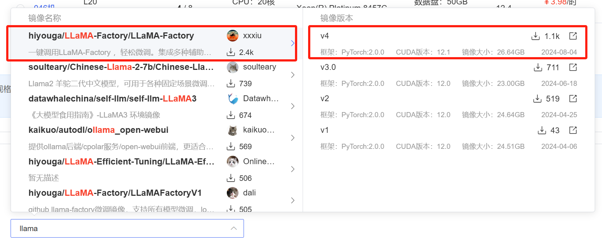
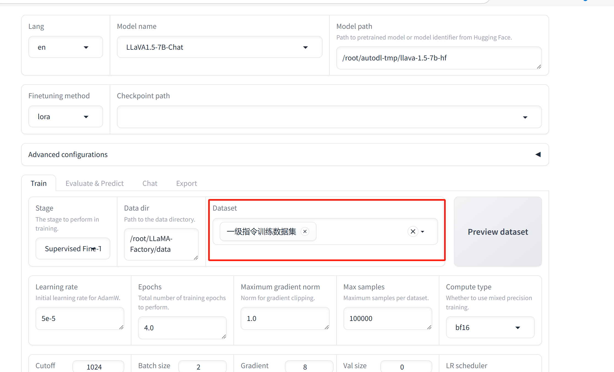
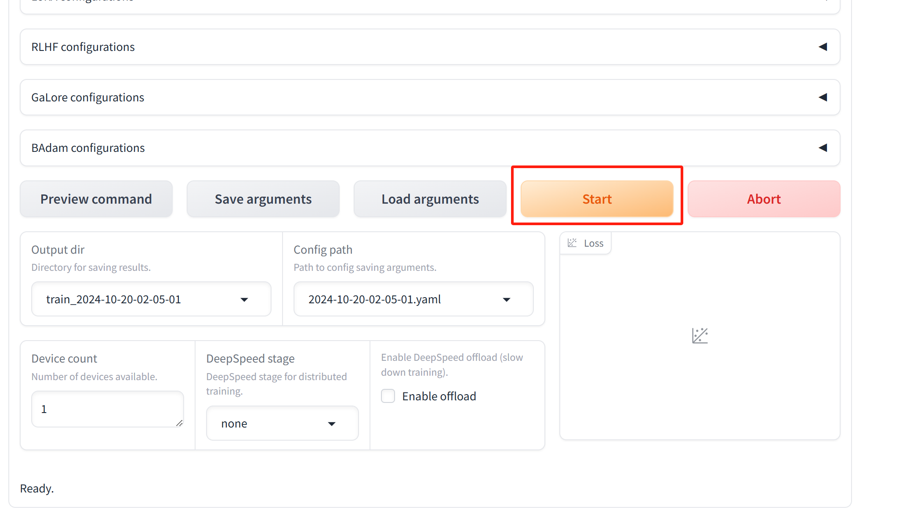
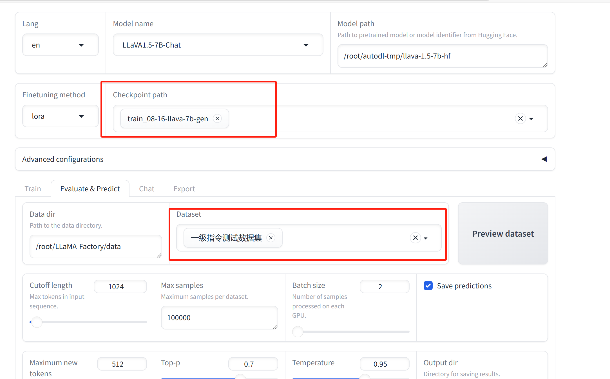

# Instruction fine-tuning

## Preparation of the Environment

We used [LLaMA-Factory](https://github.com/hiyouga/LLaMA-Factory) to fine-tune our generated dataset. For quick environment deployment, we utilized a community image on the L20 GPU available on [AutoDL](https://www.autodl.com/home).



We used [llava-1.5-7b-hf](https://huggingface.co/llava-hf/llava-1.5-7b-hf/tree/main) and [Yi-VL-6B-hf](https://huggingface.co/BUAADreamer/Yi-VL-6B-hf/tree/main) to fine-tune our dataset, and we downloaded the files from the provided links.

```shell
huggingface-cli download --resume-download --local-dir-use-symlinks False llava-hf/llava-1.5-7b-hf --local-dir /root/autodl-tmp/llava-1.5-7b-hf
```

```shell
huggingface-cli download --resume-download --local-dir-use-symlinks False BUAADreamer/Yi-VL-6B-hf --local-dir /root/autodl-tmp/Yi-VL-6B-hf
```

Download the desktop tool for connecting to the server from the following link.

https://autodl-public.ks3-cn-beijing.ksyuncs.com/tool/AutoDL-SSH-Tools.zip

## Dataset Preparation

Upload the data in JSON format to /LLaMA-Factory/data, and add the relevant information to dataset_info.json.

```json
"dataset_name": {
  "file_name": "data.json",
  "columns": {
    "prompt": "instruction",
    "query": "input",
    "response": "output",
    "images": "images"
  }
}
```

## Train

Launch the web page, then use the aforementioned desktop software to connect.

```shell
bash /root/LLaMA-Factory/chuli/one.sh
```

Set up the dataset



Start



## Test

Select the trained model and test dataset.


